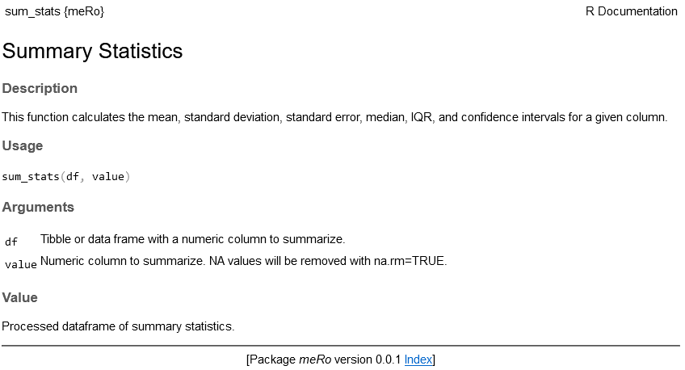
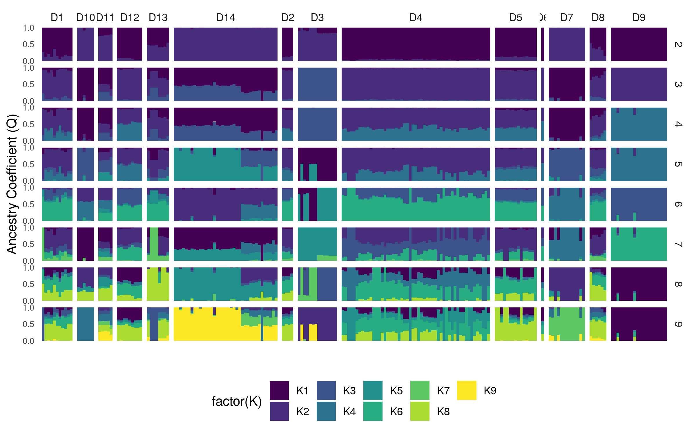

# meRo Helpful R functions

Collection of R functions for handling and visualizing -omic data. 

## Contact

For any questions or concerns, please open an issue on this repository or reach out to Justin Merondun: heritabilities@gmail.com
 
## Table of Contents

- [Installation](#installation)
- [R Scripts](#r-scripts)
  - [Summary Stats](#summary-stats)

## Installation

Installation is quick and simple if you have devtools available: 

```
devtools::install_github('merondun/meRo')
```

Functions have proper help documentation within RStudio: 

```
?sum_stats
```

Returns: 



## R Scripts

### Summary Stats 

Reports mean, median, SD, SE, IQR, and lower/upper 95% CI. Works seamlessly in tidy pipes by group. Specify NAs are removed with na.rm=TRUE. 

**INPUTS:**

Any data frame in R.

```
library(tidyverse)
library(meRo)

set.seed(123)

# Create a data frame
df = data.frame(
  rowID = 1:100,
  group = sample(c("Group1", "Group2", "Group3"), 100, replace = TRUE),
  value = rnorm(100) # Generate normally distributed random numbers
)

df %>% group_by(group) %>% sum_stats(value)
```

**OUTPUTS:**

```
# A tibble: 3 × 8
  group    mean    sd    se  median   iqr conf_low conf_high
  <chr>   <dbl> <dbl> <dbl>   <dbl> <dbl>    <dbl>     <dbl>
1 Group1 0.0424 1.10  0.192 -0.0487  1.62   -0.349     0.433
2 Group2 0.228  0.881 0.161  0.115   1.21   -0.101     0.557
3 Group3 0.106  1.19  0.196  0.251   1.49   -0.292     0.503
```

### Plot ADMIXTURE using GGplot2 

Melt admixture Q files and assign ID based on the `.fam` file. 

**INPUTS:**

Directory with ADMIXTURE `.Q` outputs, and the `.fam` file for the run within the same directory. 

```
library(tidyverse)
library(meRo)

prefix = 'admixture' #prefix name for the .Q and .fam files, within the Q directory
q_directory = '~/merondun/meRo/data/' #directory with Q files and .fam file 

#melted frame 
admix = melt_admixture(prefix = prefix, qdir = q_directory)
```

**OUTPUTS:**

Outputs a tidy frame with ID, the `Specified_K` for each Q file found, the various levels of `K` corresponding to that Q, and the ancestry coefficient `Q`. 

```
admix
# A tibble: 8,888 × 4
   ID               Specified_K K           Q
   <chr>                  <int> <chr>   <dbl>
 1 004_CB_ATP_CHN_F           2 K1    0.0892 
 2 004_CB_ATP_CHN_F           2 K2    0.911  
 3 005_CB_ORW_CHN_M           2 K1    0.00001
 4 005_CB_ORW_CHN_M           2 K2    1.00   
 5 006_CB_ATP_CHN_F           2 K1    0.0839 
 6 006_CB_ATP_CHN_F           2 K2    0.916  
 7 007_CB_ATP_CHN_F           2 K1    0.0899 
 8 007_CB_ATP_CHN_F           2 K2    0.910  
 9 008_CC_RED_FIN_M           2 K1    0.884  
10 008_CC_RED_FIN_M           2 K2    0.116 
```

This can be plotted easy enough, provided you have another metadata frame with ID and some variable of interest. You can then re-factor ID if you would like (e.g. based on distance, etc), or facet plots according to additional variables. **Always facet by `Specified_K` if you have multiple Q files**. 

```
md = read_tsv('~/merondun/meRo/data/admixture.metadata.txt')

#merge metadata and admixture matrix 
admix_md = left_join(admix,md)

#plot 
admix_md %>% 
  ggplot(aes(x = ID, y = Q, fill = factor(K))) +
  geom_col(color = NA, width = 1) +
  facet_grid(Specified_K ~ DistanceGroup, scales = "free", space = "free") +  # Switch facet labels to the left
  theme_minimal() + labs(x = "", y = "Ancestry Coefficient (Q)") +
  scale_y_continuous(expand = c(0, 0), n.breaks = 3) +  # Move y-axis to the right
  scale_x_discrete(expand = expand_scale(add = 1)) +
  scale_fill_viridis(discrete=TRUE)+
  theme(
    panel.spacing.x = unit(0.1, "lines"),
    axis.text.x = element_blank(),
    axis.text.y = element_text(size = 7),
    panel.grid = element_blank(),
    strip.placement = "outside",  #Ensure facet labels are outside the plot area
    legend.position = 'bottom'
  ) 
```
Outputs this plot: 




